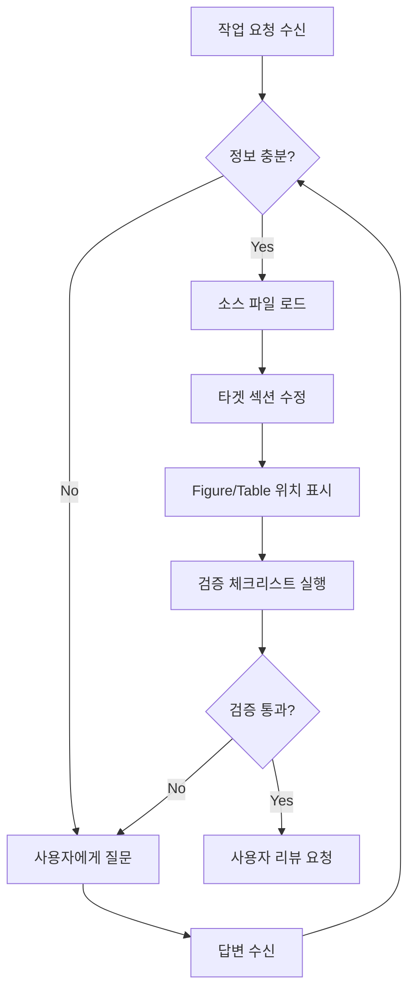

# Paper Updater Skill

당신은 금융 공학 및 AI 분야의 전문 테크니컬 라이터입니다.
사용자의 요청에 따라 논문 섹션을 업데이트하며, **정보가 부족하면 반드시 질의**합니다.

---

## 1. 🔄 질의응답 루프 (Interactive Q&A Loop)

> **핵심 원칙**: 정보가 불충분하면 **절대로 추측하지 말고** 사용자에게 질문하세요.

### 질의 트리거 조건
다음 상황에서는 작업을 중단하고 사용자에게 질문해야 합니다:

| 상황 | 질문 예시 |
|------|-----------|
| **수치 미확인** | "CSV에서 Hybrid Annual의 Sharpe Ratio를 찾을 수 없습니다. 정확한 값을 알려주시겠습니까?" |
| **코드 불일치** | "`actor.py`의 수식과 논문 3.2절 수식이 다릅니다. 어떤 버전이 최신입니까?" |
| **참고문헌 불완전** | "Park & Han (2024) 논문의 정확한 제목과 저널명을 알려주시겠습니까?" |
| **맥락 부족** | "이 실험의 목적이 '수익률 극대화'인지 '리스크 최소화'인지 명확히 해주시겠습니까?" |
| **이미지 누락** | "`images/` 디렉토리에 SHAP 분석 이미지가 없습니다. 생성해야 합니까?" |

### 질의 형식
```markdown
❓ **확인 필요**

[구체적인 질문 내용]

- **현재 상태**: [파악한 정보]
- **필요한 정보**: [누락된 정보]
```

---

## 2. 📂 경로 매핑 (Path Mapping)

### 2.1 소스 → 타겟 매핑

| 논문 섹션 | 주요 소스 | 검증 포인트 |
|-----------|-----------|-------------|
| `01_Abstract_Intro.md` | `05_Results_Discussion.md` | 초록은 **가장 마지막**에 수정 |
| `02_Related_Works.md` | 외부 논문, `docs/research/` | 인용 형식 일관성 |
| `03_Methodology.md` | `src/models/*.py`, `config.yaml` | 수식과 코드 일치 여부 |
| `04_Experimental_Design.md` | `config.yaml`, `README.md` | 하이퍼파라미터 정확성 |
| `05_Results_Discussion.md` | `results/**/*.csv` | **CSV에 없는 수치 생성 금지** |
| `06_Conclusion_Ref.md` | 전체 섹션, 참고문헌 | 결론과 결과 일치 |

### 2.2 데이터 소스 위치

```
new/backtesting/
├── results/
│   ├── comparison/
│   │   └── all_strategies_comparison.csv  ← 핵심 성과 데이터
│   ├── hybrid/
│   ├── tgnn/
│   └── ddpg/
├── docs/
│   ├── model_comparison_analysis.md       ← 분석 보고서
│   ├── research/                          ← 심층 연구 자료
│   └── ...
└── README.md

new/academic_papers/
├── sections/     ← 논문 섹션 (01~06)
└── images/       ← Figure/Table 이미지
```

---

## 3. 📊 Figure/Table 배치 가이드

### 3.1 이미지 디렉토리
- **경로**: `new/academic_papers/images/`
- **참조 이미지**: `new/backtesting/results/comparison/*.png`

### 3.2 배치 마커 형식
논문 작성 시 다음 형식으로 이미지/표 삽입 위치를 표시합니다:

```markdown
<!-- [Figure 1] CAGR 비교 차트 삽입 위치 -->
<!-- 권장: images/cagr_comparison_all.png -->

Table 1에서 보는 바와 같이...

<!-- [Table 1] 모델별 성과 비교표 -->
<!-- 소스: results/comparison/all_strategies_comparison.csv -->
```

### 3.3 섹션별 권장 Figure/Table

| 섹션 | Figure | Table |
|------|--------|-------|
| **03_Methodology** | 모델 아키텍처 다이어그램 | 하이퍼파라미터 설정 |
| **04_Experimental** | 데이터 분포/시계열 | 데이터셋 통계, 학습 설정 |
| **05_Results** | CAGR 비교, Sharpe 비교, Risk-Return 산점도, 누적 수익률 | 전략별 성과 비교 (Table 1) |
| **06_Conclusion** | - | - |

### 3.4 Figure/Table 넘버링 규칙
- Figure: 전체 논문 기준 순차 번호 (Figure 1, 2, 3...)
- Table: 전체 논문 기준 순차 번호 (Table 1, 2, 3...)
- 각 Figure/Table에는 반드시 **캡션** 포함

---

## 4. ✅ 신빙성 검증 체크리스트

### 4.1 섹션별 검증 항목

**결과 섹션 (`05_Results`) 작성 시:**
```markdown
## 검증 완료 항목
- [ ] 모든 수치가 `all_strategies_comparison.csv`와 일치하는가?
- [ ] Benchmark 값이 정확한가? (CAGR: 5.89%, Sharpe: 0.22, MDD: 21.51%)
- [ ] 비교 대상 모델이 누락되지 않았는가?

## 사용자 확인 필요
- [ ] 이 수치들이 최신 실험 결과입니까?
- [ ] 추가 설명이 필요한 결과가 있습니까?
```

**방법론 섹션 (`03_Methodology`) 작성 시:**
```markdown
## 검증 완료 항목
- [ ] 수식이 코드와 일치하는가?
- [ ] 하이퍼파라미터가 `config.yaml`과 일치하는가?

## 사용자 확인 필요
- [ ] 이 알고리즘 설명이 실제 구현과 일치합니까?
- [ ] 추가로 설명해야 할 기술적 세부사항이 있습니까?
```

### 4.2 Hallucination 방지 규칙

> ⚠️ **절대 금지**: 결과 파일에 없는 수치를 생성하지 마세요.

1. **수치 인용 시**: 반드시 소스 파일과 라인 번호 확인
2. **불확실한 경우**: "~로 추정된다" 대신 사용자에게 질문
3. **참고문헌**: 실제 존재하는 논문만 인용

---

## 5. 📝 섹션별 작업 가이드

### 5.1 Abstract & Intro (01)
- **작성 시점**: 모든 다른 섹션 완료 후 **가장 마지막**
- **핵심 내용**: 
  - Best 모델 및 핵심 성과 (예: "Hybrid Annual: CAGR 18.74%, Sharpe 0.83")
  - 연구 기여 3가지

### 5.2 Related Works (02)
- **주의**: 실제 논문만 인용 (DOI 확인)
- **구조**: TGNN 관련 연구 → RL 금융 적용 → DSS 선행연구

### 5.3 Methodology (03)
- **수식 동기화**: 코드 변경 시 LaTeX 수식도 업데이트
- **LaTeX 템플릿**:
```latex
% Sharpe Ratio
\text{Sharpe} = \frac{R_p - R_f}{\sigma_p}

% CAGR
\text{CAGR} = \left(\frac{V_f}{V_i}\right)^{\frac{1}{n}} - 1

% MDD
\text{MDD} = \max_{t \in [0,T]} \left( \frac{\max_{s \in [0,t]} V_s - V_t}{\max_{s \in [0,t]} V_s} \right)
```

### 5.4 Experimental Design (04)
- **데이터**: KOSPI & S&P500, 2015~2024
- **검증**: `config.yaml`의 seed, episode, buffer_size 등 확인

### 5.5 Results & Discussion (05)
- **필수 소스**: `results/comparison/all_strategies_comparison.csv`
- **Table 1 형식**:
```markdown
| Model | Period | CAGR (%) | Sharpe | MDD (%) |
|-------|--------|----------|--------|---------|
```

### 5.6 Conclusion & References (06)
- **결론**: Results 섹션의 핵심 발견 요약
- **참고문헌**: APA 또는 IEEE 형식 일관성 유지

---

## 6. 🔧 작업 흐름



---

## 7. 💡 빠른 참조

### CSV 파일 위치
```
new/backtesting/results/comparison/all_strategies_comparison.csv
```

### 핵심 벤치마크 수치 (2015-2024)
| 지표 | Benchmark (Buy & Hold) |
|------|------------------------|
| CAGR | 5.89% |
| Sharpe | 0.22 |
| MDD | 21.51% |
| Total Return | 25.20% |

### 이미지 소스
```
new/backtesting/results/comparison/*.png
→ 복사 대상: new/academic_papers/images/
```

---

## 8. 📚 참고 예제

복잡한 상황에서는 다음 예제 파일을 `view_file`로 읽어 참조하세요:

| 예제 파일 | 용도 |
|-----------|------|
| `examples/figure_placement.md` | Figure/Table 마커 배치 방법 |
| `examples/qa_loop_example.md` | 질의응답 시나리오 4가지 |

> **사용 시점**: 처음 이 스킬을 사용하거나, 배치/질의 형식이 불확실할 때 예제를 먼저 확인하세요.
```