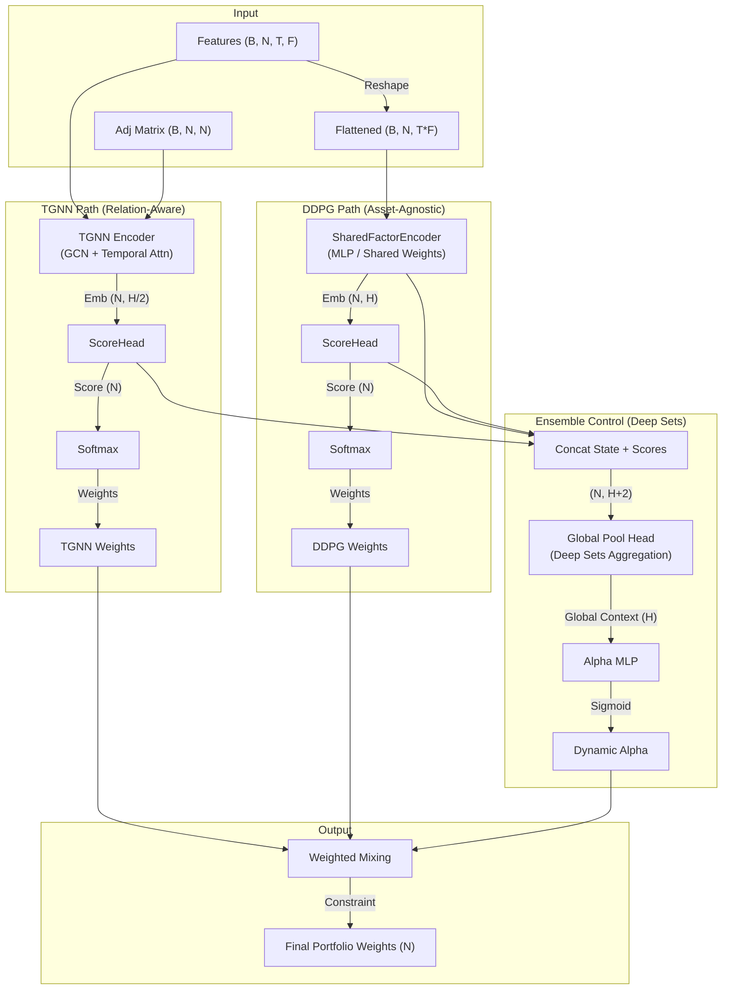

# 3. 제안 모델 (Proposed Hybrid AI Model)

## **3.1 개요 (Overview)**

본 연구는 **관계 학습(Relational Learning)**, **정책 최적화(Policy Optimization)를** 통합한 하이브리드 인공지능 기반 의사결정지원시스템(AI-based Decision Support System, AI-DSS)을 제안한다.

제안된 프레임워크는 **Temporal Graph Neural Network (TGNN)**, **Deep Deterministic Policy Gradient (DDPG)** 두 모듈로 구성되며, **예측-결정-실행**의 연속 피드백 루프를 형성한다 (Park & Han, 2024; Gu et al., 2025). AI DSS의 전체 구조는 그림 1과 같이 **데이터 수집-관계 학습-정책 최적화-비용 최소화-의사결정 피드백**의 순환 구조로 구성된다.

이 프레임워크는 단순한 데이터 분석을 넘어 **시장의 구조적 상호작용**을 학습하고, **강화학습 기반 의사결정**을 자동화하며, **DSS 내 실시간 정책 피드백**을 가능하게 한다.

### **3.1.1 자산 무관형 아키텍처 (Asset-Agnostic Architecture)**

본 연구의 핵심 기여 중 하나는 **자산 무관형(Asset-Agnostic) 구조**의 도입이다. 기존 포트폴리오 모델들이 고정된 수의 주식(N)에 대해 학습하여 유니버스 변경 시 재학습이 필요한 것과 달리, 제안된 모델은 **가변적인 시장 상황(Variable N)**에 유연하게 대응한다. 이는 **Shared Encoder(공유 가중치)**와 **Deep Sets(집합 연산)** 기술을 적용하여 달성된다.

## **3.2 관계 학습 모듈: Temporal Graph Neural Network (TGNN)**

TGNN은 Kipf & Welling (2017)이 제안한 Graph Convolutional Network(GCN)를 시간축으로 확장하여, **시장 내 주식 간 동적 상관구조**를 학습한다. 시점 t에서의 그래프 Gₜ는 노드 V(주식), 엣지 Eₜ(관계)로 구성된다. 엣지 가중치는 피어슨 상관계수와 산업 유사도를 결합해 산출된다 (Wu et al., 2021).

그래프 합성곱 연산은 다음과 같이 정의된다:

$$ H^{(l+1)} = \sigma( \tilde{D}^{-\frac{1}{2}} \tilde{A} \tilde{D}^{-\frac{1}{2}} H^{(l)} W^{(l)} ) $$

여기서 A는 인접행렬, D는 차수행렬, H는 노드 특징행렬, W는 학습 가중치이다. TGNN은 시간축에 따라 **Temporal Attention** 메커니즘을 통해 과거 시점의 관계 중요도를 동적으로 반영한다. 이때 **ScoreHead**는 학습된 노드 임베딩을 입력받아 각 종목의 매수 매력도(Score)를 산출하며, 이는 Softmax를 통해 포트폴리오 비중으로 변환된다.

## **3.3 정책 학습 모듈: Deep Deterministic Policy Gradient (DDPG)**

정책 학습 모듈은 **자산 무관형(Asset-Agnostic) 강화학습**을 수행한다.
1.  **SharedFactorEncoder**: 개별 종목의 시계열 특징을 처리하는 공유 인코더(Shared MLP)를 사용하여, 종목 수(N)에 관계없이 동일한 파라미터로 특징을 추출한다.
2.  **ScoreHead & Softmax**: 추출된 특징으로부터 점수를 계산하고, Softmax를 통해 합이 1인 비중을 생성한다. 이 과정은 입력 종목 수 N에 따라 자동으로 확장된다.
3.  **Deep Sets Critic**: Critic 네트워크는 상태-행동 쌍(State-Action Pair)을 평가할 때 **Deep Sets** 구조를 사용한다. 개별 종목의 상태와 행동을 임베딩한 후 **Global Mean Pooling**을 통해 전체 포트폴리오 수준의 Q-value를 추정하므로, 포트폴리오 크기가 변해도 재학습 없이 평가 가능하다.

$$ Q(S, A) = \rho \left( \sum_{i=1}^{N} \phi(s_i, a_i) \right) $$

여기서 $\phi$는 로컬 인코더, $\rho$는 글로벌 Q-Head이다.

## **3.4 AI DSS 시스템 통합 구조 (System Integration Framework)**

세 모듈은 **Python 기반 Flask API 서버**에서 AI 엔진으로 작동하며, **Spring Boot 백엔드**와 **React 프런트엔드**를 통해 DSS 대시보드로 통합된다 (Park & Han, 2024). **Ensemble Control** 모듈은 TGNN과 DDPG의 예측 신뢰도를 실시간으로 평가하여 최적의 혼합 비율($\alpha$)을 **Global Pooling**을 통해 동적으로 결정한다.

### **3.4.1 동적 제약 조건 (Dynamic Constraints)**
시장 상황에 따라 최대 낙폭(MDD)을 모니터링하여, 변동성이 높을 때는 방어적인 포트폴리오 제약을, 안정적일 때는 적극적인 투자를 허용하도록 제약 조건이 동적으로 조정된다.

| **모듈** | **주요 역할** | **핵심 기술** | **DSS 기여도** |
| --- | --- | --- | --- |
| TGNN | 관계 학습 | Graph Conv + Temporal Attn | 시장 구조 인식 |
| DDPG | 정책 최적화 | Asset-Agnostic (Shared Weights + Deep Sets) | 가변 유니버스 대응 및 최적화 |
| Ensemble | 통합 제어 | Global Pooling (Alpha) | 상황별 모델 가중치 동적 조절 |
| 통합 시스템 | DSS 운영 | Flask–Spring–React 구조 | 실시간 피드백 & XAI |
