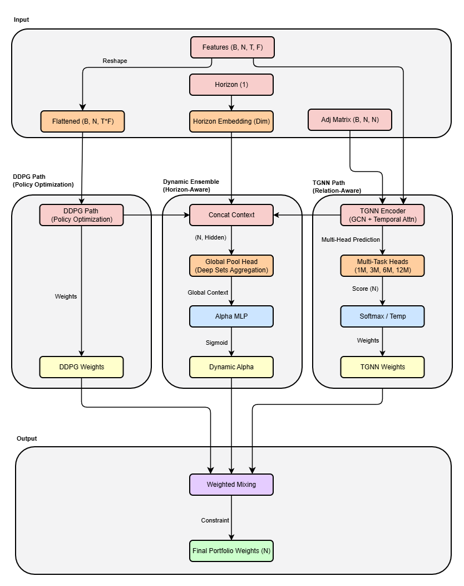

# 3. 제안 모델 (Proposed Hybrid AI Model)

## 3.1 개요 (Overview)

본 연구는 관계 학습(Relational Learning)과 정책 최적화(Policy Optimization)를 통합한 하이브리드 인공지능 기반 의사결정지원시스템(AI-based Decision Support System, AI-DSS)을 제안한다.

제안된 프레임워크는 Temporal Graph Neural Network (TGNN)와 Deep Deterministic Policy Gradient (DDPG) 두 모듈을 결합한 하이브리드 에이전트(Hybrid Agent) 구조를 기반으로 하며, 예측-결정-실행의 연속 피드백 루프를 형성한다. AI DSS의 전체 구조는 Figure 1과 같이 데이터 수집-관계 학습-정책 최적화-비용 최소화-의사결정 피드백의 순환 구조로 구성된다.

이 프레임워크는 단순한 데이터 분석을 넘어 시장의 구조적 상호작용을 학습하고, 강화학습 기반 의사결정을 자동화하며, DSS 내 실시간 정책 피드백을 가능하게 한다. 특히 본 연구에서는 기존의 단일 통합 모델 구조를 개선하여, 독립적인 DDPG와 TGNN 인스턴스를 조합(Composition)하고 리밸런싱 주기에 따라 가중치를 동적으로 조절하는 Horizon-Aware Ensemble 메커니즘을 도입하였다.

### 3.1.1 자산 무관형 아키텍처 (Asset-Agnostic Architecture)

본 연구의 핵심 기여 중 하나는 자산 무관형(Asset-Agnostic) 구조의 도입이다. 기존 포트폴리오 모델들이 고정된 수의 주식(N)에 대해 학습하여 유니버스 변경 시 재학습이 필요한 것과 달리, 제안된 모델은 가변적인 시장 상황(Variable N)에 유연하게 대응한다. 이는 Shared Encoder(공유 가중치)와 Deep Sets(집합 연산) 기술을 적용하여 달성된다.

**Figure 1.** Proposed Hybrid AI-DSS Framework Architecture

## 3.2 관계 학습 모듈: Temporal Graph Neural Network (TGNN)

TGNN은 Kipf & Welling (2017)이 제안한 Graph Convolutional Network(GCN)를 시간축으로 확장하여, 시장 내 주식 간 동적 상관구조를 학습한다. 시점 t에서의 그래프 $G_t$는 노드 $V$(주식), 엣지 $E_t$(관계)로 구성된다. 엣지 가중치는 피어슨 상관계수와 산업 유사도를 결합해 산출된다.

### Context-Aware Dual-Path Encoder

본 연구에서는 가격 데이터와 거시경제 지표를 분리 처리하는 **Dual-Path Encoder** 구조를 채택하였다:

- **Price Encoder**: GRU(Gated Recurrent Unit)를 사용하여 종목별 가격 시계열($[B, N, T, 5]$)을 학습
- **Macro Encoder**: 1D-CNN을 사용하여 Fama-French 5-Factor 등 거시경제 지표($[B, N, T, 5]$)를 학습

두 경로의 출력은 Concatenation 후 GCN 레이어로 전달되어 공간적 관계를 학습한다. 그래프 합성곱 연산은 다음과 같이 정의된다:

$$
H^{(l+1)} = \sigma( \tilde{D}^{-\frac{1}{2}} \tilde{A} \tilde{D}^{-\frac{1}{2}} H^{(l)} W^{(l)} )
$$

여기서 $\tilde{A} = A + I$는 자기 연결이 추가된 인접행렬, $\tilde{D}$는 차수행렬이다. 본 모델은 안정적 학습을 위해 잔차 연결(Residual Connection)과 Layer Normalization을 적용하였다.

### Multi-Head Prediction & Loss Function

4가지 기간(1개월, 3개월, 6개월, 12개월)의 가격 모멘텀을 동시에 예측하는 멀티 태스크(Multi-Task) 구조를 채택하였다. 손실 함수는 절대 오차와 상대 순위를 모두 고려한 복합 손실을 사용한다:

$$ \mathcal{L} = \alpha \cdot \mathcal{L}_{MSE} + \beta \cdot \mathcal{L}_{Ranking} $$

여기서 $\alpha = 0.7$, $\beta = 0.3$이며, Ranking Loss는 "A가 B보다 수익률이 높으면, 예측값도 A > B여야 한다"는 쌍별 순위를 수식화한다.

## 3.3 정책 학습 모듈: Deep Deterministic Policy Gradient (DDPG)

정책 학습 모듈은 자산 무관형(Asset-Agnostic) 강화학습을 수행한다.

1.  **SharedFactorEncoder**: 개별 종목의 시계열 특징을 처리하는 공유 인코더(Shared MLP)를 사용하여, 종목 수(N)에 관계없이 동일한 파라미터로 특징을 추출한다.
2.  **ScoreHead & Portfolio Softmax**: 추출된 특징으로부터 점수를 계산하고, **Temperature-scaled Softmax**를 통해 합이 1인 비중을 생성한다. Temperature 파라미터($\tau = 3.0$)는 포트폴리오 분산도를 조절하며, 높은 값은 균등 배분에 가까운 비중을, 낮은 값은 집중 투자를 유도한다.

$$ W_i = \frac{\exp(s_i / \tau)}{\sum_{j=1}^{N} \exp(s_j / \tau)} $$

3.  **Deep Sets Critic**: Critic 네트워크는 상태-행동 쌍(State-Action Pair)을 평가할 때 Deep Sets 구조를 사용하여, 포트폴리오 크기가 변해도 재학습 없이 Q-value를 추정한다.

$$
Q(S, A) = \rho \left( \sum_{i=1}^{N} \phi(s_i, a_i) \right)
$$

여기서 $\phi$는 로컬 인코더, $\rho$는 글로벌 Q-Head이다.

## 3.4 Hybrid Alpha & System Integration

세 모듈은 Python 기반 Flask API 서버에서 AI 엔진으로 작동하며, Spring Boot 백엔드와 React 프런트엔드를 통해 DSS 대시보드로 통합된다.

### 3.4.1 Horizon-Aware Dynamic Alpha

본 연구는 TGNN(예측 기반)과 DDPG(정책 기반)의 기여도를 동적으로 조절하기 위해 **Horizon Embedding**을 도입하였다. 리밸런싱 주기(Horizon) 정보(0: Monthly, 1: Quarterly, 2: Semiannual, 3: Annual)를 임베딩 벡터로 변환하여 앙상블 네트워크에 주입한다.

최종 포트폴리오 비중 $W_{final}$은 다음과 같이 계산된다:

$$
W_{final} = \alpha \cdot W_{TGNN} + (1 - \alpha) \cdot W_{DDPG}
$$

여기서 $\alpha$는 Global Pooling Network를 통해 산출된 동적 가중치이며, **Mode Collapse 방지**를 위해 $\alpha \in [0.2, 0.8]$ 범위로 클램핑(Clamping)된다. 이를 통해 한 모델이 100% 비중을 가져가는 것을 방지하고, TGNN(예측)과 DDPG(최적화)의 장점을 항상 혼합하여 과적합을 방지한다.

| 모듈        | 주요 역할   | 핵심 기술                       | DSS 기여도                      |
| ----------- | ----------- | ------------------------------- | ------------------------------- |
| TGNN        | 관계 학습   | Multi-Head GCN + Temporal Attn  | 시장 구조 및 추세 동시 학습     |
| DDPG        | 정책 최적화 | Asset-Agnostic (Shared Weights) | 가변 유니버스 대응 및 최적화    |
| Ensemble    | 통합 제어   | Horizon-Aware Dynamic Alpha     | 투자 주기에 따른 최적 모델 조합 |
| 통합 시스템 | DSS 운영    | Flask–Spring–React 구조         | 실시간 피드백 & XAI             |

**Table 1.** 하이브리드 AI DSS 모듈별 역할 및 핵심 기술 요약
