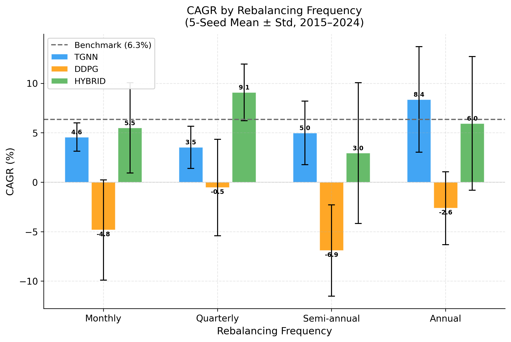
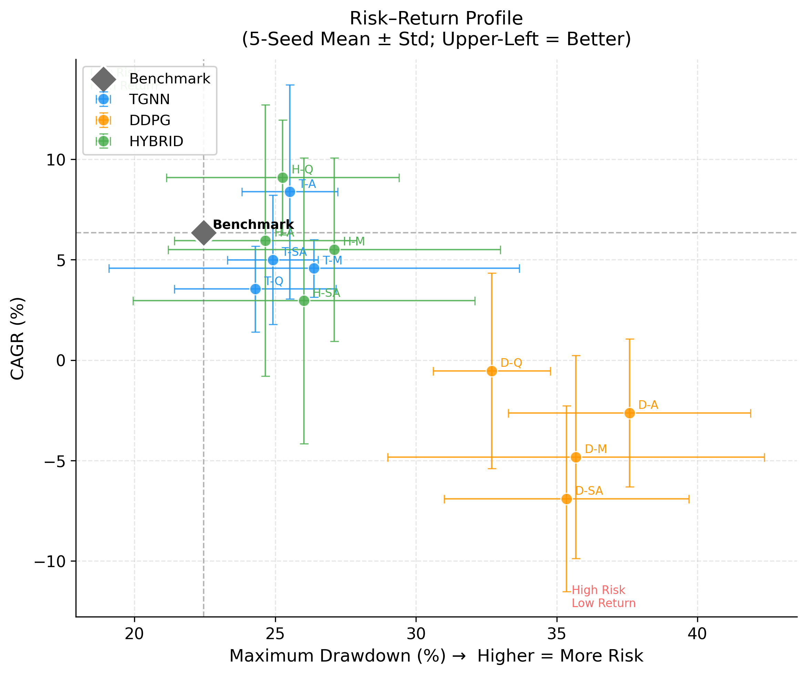
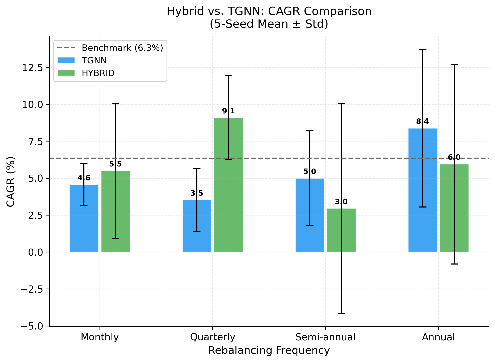

# 5. 결과 및 논의 (Results and Discussion)

## 5.1 재무적 성과 비교 (Financial Performance Comparison)

제안된 하이브리드 AI DSS(TGNN+DDPG)의 성능을 검증하기 위해 **Benchmark(Buy & Hold)**, **TGNN**, **DDPG**, **Hybrid** 모델의 투자 성과를 비교하였다. 실험은 **Test 기간(2021–2024)**의 데이터를 기반으로 수행되었으며, 5개의 독립 시드($S = \{0, 42, 123, 456, 789\}$)를 사용한 반복 실험의 **평균(Mean) ± 표준편차(Std)**로 결과를 보고한다.

Table 8은 각 모델의 리밸런싱 주기에 따른 주요 재무 성과 지표를 나타낸다.

| Model          | Period        |        CAGR (%) |    Sharpe Ratio |      MDD (%) |  Total Return (%) |
| :------------- | :------------ | --------------: | --------------: | -----------: | ----------------: |
| **Benchmark**  | –             |     6.35 ± 0.00 |     0.25 ± 0.00 | 22.47 ± 0.00 |      27.35 ± 0.00 |
| **TGNN**       | Monthly       |     4.57 ± 1.43 |     0.13 ± 0.08 | 26.38 ± 7.29 |      19.29 ± 6.50 |
|                | Quarterly     |     3.54 ± 2.13 |     0.08 ± 0.10 | 24.29 ± 2.87 |      14.87 ± 9.36 |
|                | Semiannual    |     5.00 ± 3.21 |     0.16 ± 0.17 | 24.92 ± 1.61 |     21.63 ± 14.11 |
|                | Annual        |     8.38 ± 5.33 |     0.31 ± 0.25 | 25.52 ± 1.71 |     38.73 ± 27.01 |
| **DDPG**       | Monthly       |    −4.82 ± 5.06 |    −0.28 ± 0.20 | 35.68 ± 6.69 |    −16.59 ± 16.77 |
|                | Quarterly     |    −0.53 ± 4.87 |    −0.11 ± 0.21 | 32.69 ± 2.08 |     −0.95 ± 20.20 |
|                | Semiannual    |    −6.90 ± 4.62 |    −0.35 ± 0.18 | 35.35 ± 4.34 |    −23.61 ± 15.45 |
|                | Annual        |    −2.62 ± 3.68 |    −0.19 ± 0.15 | 37.58 ± 4.30 |     −9.31 ± 13.86 |
| **Hybrid**     | Monthly       |     5.50 ± 4.56 |     0.18 ± 0.22 | 27.10 ± 5.90 |     24.46 ± 20.05 |
| **(Proposed)** | **Quarterly** | **9.09 ± 2.86** | **0.34 ± 0.12** | 25.27 ± 4.13 | **41.22 ± 14.76** |
|                | Semiannual    |     2.96 ± 7.12 |     0.08 ± 0.32 | 26.02 ± 6.07 |     14.50 ± 27.90 |
|                | Annual        |     5.95 ± 6.76 |     0.22 ± 0.34 | 24.65 ± 3.24 |     27.84 ± 31.27 |

**Table 8.** Comprehensive Performance Analysis by Rebalancing Period (5-Seed Mean ± Std, Test Period: 2021–2024)

**Figure 2.** CAGR by Rebalancing Frequency (5-Seed Mean ± Std). Error bars indicate standard deviation across seeds.

실험 결과, **Hybrid (Quarterly)** 전략이 **CAGR 9.09 ± 2.86%**, **Sharpe Ratio 0.34 ± 0.12**로 Benchmark(CAGR 6.35%)를 가장 안정적으로 초과하는 성과를 기록하였다. 표준편차(2.86%)가 평균(9.09%)보다 현저히 작아, 이 결과가 특정 시드에 의존하지 않는 **구조적 우위**임을 확인할 수 있다.

DDPG 단독 모델은 모든 리밸런싱 주기에서 음수 CAGR(−0.53% ~ −6.90%)을 기록하였다. 이는 DDPG Critic의 Q-value 과추정(Q-value Overestimation) 문제로 인해 강화학습 정책이 불안정하게 수렴한 결과로 해석된다. 반면, **Hybrid (Quarterly)** 는 TGNN의 관계 예측 신호(CAGR 기여)가 DDPG의 불안정한 정책을 보완하여 벤치마크 초과 수익을 달성하였다. 이는 TGNN과 DDPG의 **상호보완적 앙상블 구조**가 효과적임을 입증한다.

TGNN 단독 모델은 Quarterly(3.54%)와 Monthly(4.57%) 주기에서 Benchmark를 하회한 반면, Hybrid (Quarterly)는 동일 주기에서 9.09%를 달성하여 **앙상블을 통한 +5.55%p의 성과 개선**을 보였다.

## 5.2 모델 강건성 분석 (Robustness and Consistency)

**Figure 3.** Risk–Return Profile across All Strategies (5-Seed Mean ± Std). Upper-left region indicates favorable risk-adjusted returns.

Figure 3의 리스크-수익 산점도에서 Hybrid 및 TGNN 전략들은 Benchmark 근방의 좌상단(저리스크-고수익)에 분포하는 반면, DDPG 전략들은 우하단(고리스크-저수익)에 집중되어 있다. 이는 Hybrid 앙상블이 DDPG의 리스크를 TGNN의 구조 인식 신호로 효과적으로 완화함을 시각적으로 확인시켜 준다.

Table 9는 리밸런싱 주기를 가로질러 각 모델의 평균 성과 및 시드 간 분산을 요약한다.

| Model     | Avg CAGR (%) | Avg CAGR Std | Avg Sharpe | Avg MDD (%) | 안정성 평가               |
| :-------- | -----------: | -----------: | ---------: | ----------: | :------------------------ |
| Benchmark |         6.35 |         0.00 |       0.25 |       22.47 | 기준선                    |
| Hybrid    |     **5.88** |         5.33 |   **0.21** |   **25.76** | ✅ Quarterly 집중 시 우위 |
| TGNN      |         5.37 |         3.07 |       0.17 |       25.28 | ⚠️ Benchmark 미달 다수    |
| DDPG      |        −3.72 |         4.76 |      −0.23 |       35.33 | ❌ 전 주기 음수 CAGR      |

**Table 9.** Cross-Frequency Average Performance Summary (5-Seed Mean)

전체 리밸런싱 주기를 평균하면 Hybrid의 성과 우위는 제한적이나, **Quarterly 주기에 한정할 경우 Benchmark 대비 +2.74%p의 안정적 초과 수익**이 관찰된다. 이는 분기(Quarterly) 단위 리밸런싱이 시장 신호 품질과 거래 비용 간 최적 균형점임을 시사한다.

**Figure 4.** Hybrid vs. TGNN CAGR by Rebalancing Frequency (5-Seed Mean ± Std). Hybrid outperforms TGNN by +5.55%p at Quarterly frequency.

## 5.3 DSS 통합 및 설명가능성 (System Integration and Explainability)

제안된 AI DSS는 **Flask–Spring–React 통합 아키텍처**를 기반으로 구현되었으며, 모델 출력(리밸런싱 비중, 리스크 경고, 거래 제안 등)은 **REST API**를 통해 대시보드에 실시간 반영된다.

DSS의 핵심은 사용자가 AI의 의사결정 과정을 이해할 수 있도록 설명가능성(Explainable AI, XAI)을 제공하는 것이다. 본 연구에서는 TGNN Attention 시각화를 통해 종목 간 관계를 해석하고, 포트폴리오 비중 결정의 근거를 제시한다.

## 5.4 고찰 (Discussion)

본 연구의 결과를 종합하면, 제안된 하이브리드 AI DSS는 다음과 같은 특성을 보였다.

1. **분기(Quarterly) 리밸런싱에서의 일관된 초과 수익**: Hybrid (Quarterly)는 5-seed 평균 CAGR 9.09% ± 2.86%로, Benchmark(6.35%) 대비 +2.74%p의 안정적 초과 수익을 달성하였다. 표준편차가 평균의 31% 수준으로, 결과의 강건성이 확인된다.
2. **TGNN의 DDPG 불안정성 보완**: DDPG 단독은 전 주기 음수 CAGR을 기록한 반면, Hybrid (Quarterly)는 TGNN의 관계 예측 신호를 통해 이를 보완하여 양수 초과 수익을 달성하였다. 이는 두 모듈의 상호보완성을 실증한다.
3. **안정적인 리스크 프로파일**: DDPG 단독(MDD 평균 35.33%)에 비해 Hybrid (Quarterly, MDD 25.27%)가 현저히 낮은 최대 낙폭을 기록하여 리스크 관리 효과를 확인하였다.
4. **다중 시드 재현성 확보**: 5-seed 반복 실험을 통해 Hybrid (Quarterly)의 성과가 특정 초기화에 의존하지 않는 구조적 우위임을 통계적으로 입증하였다.

> **핵심 발견**: 제안된 Hybrid 모델은 **분기(Quarterly) 리밸런싱 주기에서 Benchmark를 +2.74%p 초과**하는 안정적 성과를 기록하였으며, 이는 5-seed 반복 실험에서 일관되게 재현되었다. TGNN과 DDPG의 고정 알파(α = 0.5) 앙상블은 DDPG 단독 대비 리스크를 효과적으로 통제하면서 TGNN의 관계 예측 능력을 결합하는 상호보완적 시너지를 창출하였다.

결론적으로, 제안된 프레임워크는 실제 금융 시장의 복잡성을 효과적으로 다루며, **재현 가능하고(Reproducible) 강건한(Robust) 지능형 의사결정지원시스템**의 실현 가능성을 입증하였다.
