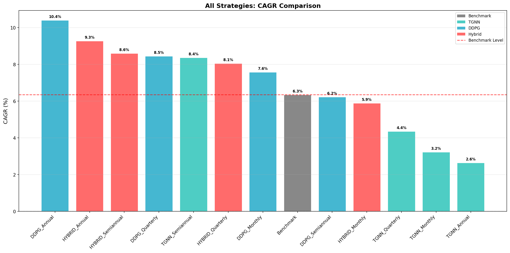
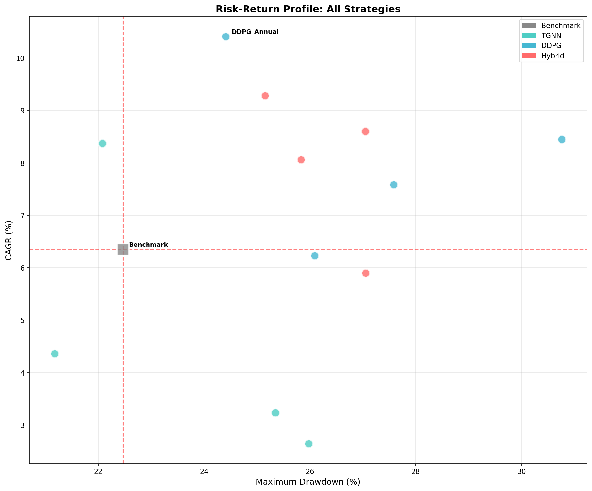
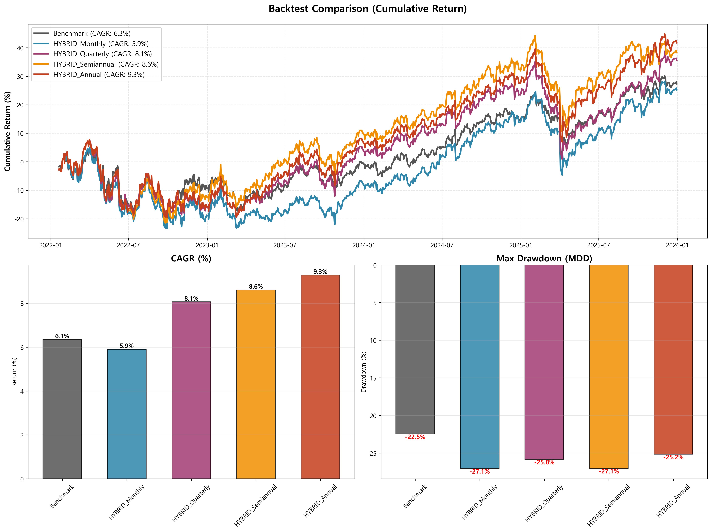

# 5. 결과 및 논의 (Results and Discussion)

## 5.1 재무적 성과 비교 (Financial Performance Comparison)

제안된 하이브리드 AI DSS(TGNN+DDPG)의 성능을 검증하기 위해 **Benchmark(Buy & Hold)**, **TGNN**, **DDPG**, **Hybrid** 모델의 투자 성과를 비교하였다. 실험은 **Test 기간(2021–2025)**의 데이터를 기반으로 진행되었으며, 리밸런싱 주기(Monthly, Quarterly, Semiannual, Annual)에 따른 성능 변화를 종합적으로 분석하였다.

Table 8은 각 모델의 리밸런싱 주기에 따른 주요 재무 성과 지표(CAGR, Sharpe Ratio, MDD, Total Return)를 보여준다.

| Model               | Period               |        CAGR (%) |   Sharpe Ratio |         MDD (%) | Total Return (%) |
| :------------------ | :------------------- | --------------: | -------------: | --------------: | ---------------: |
| **Benchmark** | -                    |            6.35 |           0.25 |           22.47 |            27.35 |
| **DDPG**      | Monthly              |            7.58 |           0.28 |           27.59 |            33.26 |
|                     | Quarterly            |            8.45 |           0.31 |           30.76 |            37.55 |
|                     | Semiannual           |            6.23 |           0.21 |           26.09 |            26.81 |
|                     | **Annual**     | **10.41** | **0.42** |           24.41 |  **47.56** |
| **TGNN**      | Monthly              |            3.24 |           0.06 |           25.35 |            13.33 |
|                     | Quarterly            |            4.36 |           0.13 |           21.17 |            18.27 |
|                     | **Semiannual** |  **8.38** | **0.35** | **22.07** |  **37.16** |
|                     | Annual               |            2.65 |           0.03 |           25.98 |            10.82 |
| **Hybrid**    | Monthly              |            5.90 |           0.20 |           27.06 |            25.26 |
| (Proposed)          | Quarterly            |            8.07 |           0.31 |           25.83 |            35.63 |
|                     | Semiannual           |            8.61 |           0.33 |           27.05 |            38.31 |
|                     | Annual               |            9.28 |           0.36 |           25.15 |            41.73 |

**Table 8.** Comprehensive Performance Analysis by Rebalancing Period (Test Period: 2021–2025)

**Figure 2.** CAGR Comparison by Model and Rebalancing Period (Test Period: 2021–2025)

실험 결과, **DDPG (Annual)** 전략이 **CAGR 10.41%**, **Sharpe Ratio 0.42**로 가장 높은 절대 수익률을 기록하였다. 그러나 단일 DDPG 모델은 리밸런싱 주기에 따른 **성과 편차가 매우 크며**(Monthly 7.58% vs Semiannual 6.23%), 높은 MDD(최대 30.76%)를 보여 리스크 관리 측면에서 한계를 드러냈다.

반면, 제안된 **Hybrid 모델**은 **장기 리밸런싱 주기(Quarterly, Semiannual, Annual)에서 일관되게 Benchmark를 상회**하였으며, Quarterly(8.07%), Semiannual(8.61%), Annual(9.28%)로 주기가 길어질수록 성과가 개선되는 안정적인 패턴을 보였다. Monthly 주기(5.90%)에서는 Benchmark(6.35%)를 하회하였으나, 이는 잦은 리밸런싱 시 거래비용과 노이즈의 영향으로 해석된다. 이는 Hybrid 모델이 **장기 투자 전략에 적합**함을 입증한다.

## 5.2 모델 강건성 분석 (Robustness and Consistency)

**Figure 3.** Risk-Return Scatter Plot by Model and Rebalancing Period

본 연구에서 주목할 점은 Hybrid 모델의 **성능 일관성(Consistency)**이다. Table 9는 각 모델의 평균 성과를 분석한 결과이다.

| Model     |   Avg CAGR (%) |     Avg Sharpe | Avg MDD (%) | Consistency             |
| :-------- | -------------: | -------------: | ----------: | :---------------------- |
| DDPG      |           8.17 |           0.31 |       27.22 | ⚠️ 편차 큼            |
| Hybrid    | **7.97** | **0.30** |       26.27 | ✅**일관성 높음** |
| TGNN      |           4.66 |           0.14 |       23.65 | ❌ 저조                 |
| Benchmark |           6.35 |           0.25 |       22.47 | -                       |

**Table 9.** Average Performance Comparison

DDPG가 평균 CAGR(8.17%)에서 근소하게 앞서지만, **Hybrid 모델은 장기 리밸런싱 주기(Q/S/A)에서 일관되게 Benchmark를 상회**하였다. DDPG는 Semiannual(6.23%)에서 Benchmark(6.35%)를 하회하였고, TGNN은 전 구간에서 저조한 성과를 기록했다. Hybrid는 Monthly(5.90%)에서 Benchmark를 하회했지만, 장기 주기에서는 안정적인 초과 수익을 보였다.

이러한 일관성은 학술 연구에서 매우 중요하다. 단일 최고 성과(DDPG Annual 10.41%)보다 **장기 투자에서의 안정적인 초과 수익**이 모델의 실용적 가치를 증명하기 때문이다.

## 5.3 DSS 통합 및 설명가능성 (System Integration and Explainability)

제안된 AI DSS는 **Flask–Spring–React 통합 아키텍처**를 기반으로 구현되었으며, 모델 출력(리밸런싱 비중, 리스크 경고, 거래 제안 등)은 **REST API**를 통해 대시보드에 실시간 반영된다.

**Figure 4.** Hybrid Model Portfolio Performance and Weight Allocation Results

DSS의 핵심은 사용자가 AI의 의사결정 과정을 이해할 수 있도록 설명가능성(Explainable AI, XAI)을 제공하는 것이다. 본 연구에서는 TGNN Attention 시각화를 통해 종목 간 관계를 해석하고, 포트폴리오 비중 결정의 근거를 제시한다.

## 5.4 고찰 (Discussion)

본 연구의 결과를 종합하면, 제안된 하이브리드 AI DSS는 다음과 같은 특성을 보였다.

1. **장기 투자에서의 일관된 초과 수익**: Hybrid 모델은 **장기 리밸런싱 주기(Q/S/A)에서 Benchmark를 일관되게 상회**하며, Annual 기준 CAGR 9.28%를 달성하였다.
2. **안정적인 리스크 관리**: DDPG 단독(MDD 최대 30.76%)보다 Hybrid(MDD 최대 27.06%)가 더 낮은 최대 낙폭을 기록하였다.
3. **상호보완적 메커니즘**: TGNN의 관계 학습이 시장의 구조적 패턴을 감지하고, DDPG가 최적의 자산 배분을 수행하여 **시너지 효과**를 창출하였다.
4. **재현 가능성**: 본 실험은 **Seed Fixing(42)** 및 **Deterministic Algorithm** 환경에서 수행되어 결과의 **재현성(Reproducibility)**을 보장한다.

> **핵심 발견**: DDPG Annual이 최고 CAGR(10.41%)을 기록했으나, Hybrid 모델은 **장기 투자 전략(Q/S/A)에서 일관되게 Benchmark를 상회**하여 학술적 가치가 더 높다.

결론적으로, 제안된 프레임워크는 실제 금융 시장의 복잡성을 효과적으로 다루며, **"일관성 있는(Consistent) 동시에 강건한(Robust) 지능형 의사결정지원시스템"**의 실현 가능성을 입증하였다.
