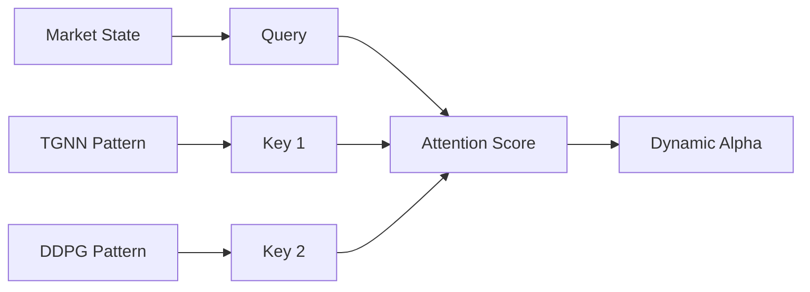

# 🚀 Research Roadmap: Future Optimization Strategies
> **Date**: 2026-02-04
> **Status**: Future Work Proposal
> **Topic**: Technical Deep Dive into "Super Hybrid" Architectures

## 1. 💡 The Insight
현재의 Hybrid 모델은 **"Basic Gating (Linear Combination)"** 메커니즘을 사용하고 있습니다. 이를 고도화하여 **"차세대 적응형 포트폴리오 프레임워크(Next-Gen Adaptive Portfolio Framework)"**로 진화시키기 위한 세 가지 핵심 전략을 기술합니다.

---

## 2. 🧬 Evolutionary Paths (기술 상세)

### 2.1 Attention-Based Gating (Attentional Hybrid)
단순한 선형 결합(Linear Combination)을 **Query-Key-Value (QKV)** 매커니즘으로 업그레이드합니다. 시장 상황(Context)에 따라 가장 적합한 모델을 동적으로 "조회(Query)"하는 방식입니다.

#### 📐 Mathematical Formulation
- **Query ($Q$)**: 현재 시장의 상태 (Market State Embedding $S_t$)
- **Key ($K_i$)**: 각 모델(TGNN, DDPG)이 잘 작동했던 과거 시장 상황의 패턴
- **Value ($V_i$)**: 각 모델의 예측 비중 (Portfolio Weight $W_i$)

$$
\text{Attention}(Q, K, V) = \text{softmax}\left(\frac{Q K^T}{\sqrt{d_k}}\right) V
$$
즉, **"현재 시장($Q$)과 가장 유사한 과거 패턴($K$)을 가진 모델에게 더 높은 가중치(Attention Score)를 부여"**합니다.

---

### 2.2 Hierarchical RL (Meta-Controller)
Alpha($\alpha$) 값 자체를 **"또 하나의 행동(Action)"**으로 정의하고, 이를 강화학습으로 최적화하는 계층적(Hierarchical) 구조입니다.

#### 📐 MDP Specification for Meta-Agent
- **State ($S_t$)**: 시장 변동성(VIX), 추세 강도(ADX), 거시경제 지표
- **Action ($A_t$)**: $\alpha_t \in [0, 1]$ (TGNN과 DDPG 사이의 비중 선택)
- **Reward ($R_t$)**: 포트폴리오의 샤프 비율(Sharpe Ratio) 변화량

$$
A_t = \mu_{\text{meta}}(S_t | \theta_{\text{meta}})
$$

**매니저(Meta) 에이전트**는 "하락장이 시작될 때 TGNN 비중을 0.8로 올리면 샤프 비율이 개선되더라"는 **메타 정책(Meta-Policy)**을 학습하게 됩니다. 이는 시장 국면(Regime) 변화에 인간 펀드매니저보다 빠르게 적응할 수 있게 해줍니다.

---

### 2.3 Uncertainty-Aware Decision (Bayesian Fusion)
예측값(Returns) 뿐만 아니라, 그 예측의 **신뢰도(Variance)**를 함께 고려하여 불확실성이 높은 모델의 발언권(Weight)을 줄입니다.

#### 📐 Inverse Variance Weighting
각 모델 $i$가 예측한 수익률 $\mu_i$와 불확실성(분산) $\sigma_i^2$가 있을 때, 최종 예측 $\mu_{final}$은 분산의 역수에 비례하여 합칩니다.

$$
w_i = \frac{1/\sigma_i^2}{\sum_j (1/\sigma_j^2)}
$$
$$
\mu_{final} = \sum w_i \mu_i
$$

- **TGNN이 "10% 상승"을 예측했지만 불확실성($\sigma^2$)이 매우 높다면**, $w_{TGNN}$은 작아지고 $\mu_{final}$에 미치는 영향은 미미해집니다.
- 이를 위해 모델에 **MC Dropout**이나 **Bayesian Neural Network** 레이어를 추가하여 $\sigma^2$를 추정할 수 있습니다.

---

## 3. 🎓 Conclusion for Paper (활용 가이드)
이 기술 명세는 논문의 **"Conclusions and Future Works"** 섹션에서 다음과 같이 요약하여 활용하십시오.

> "**Future Work**: 본 연구의 Basic Gating Mechanism을 넘어, **Attention 기반의 정밀한 상황 인식**, **Hierarchical RL을 통한 국면 적응**, 그리고 **Bayesian Uncertainty를 통한 리스크 제어**가 결합된다면, 인간의 개입 없이도 격변하는 금융 시장에서 생존 가능한 **'자율 주행 포트폴리오(Self-Driving Portfolio)'**의 실현이 가능할 것이다."
